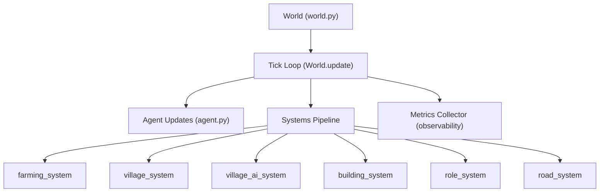
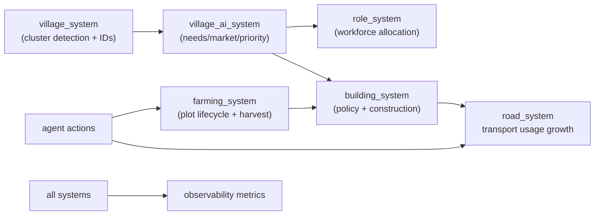
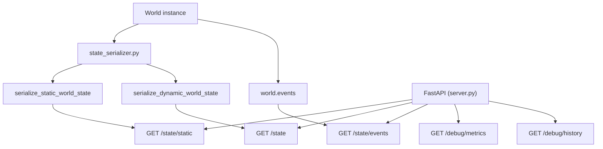
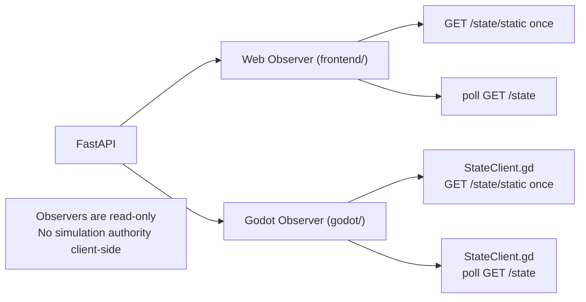

# AI Civilization Sandbox Architecture

This document summarizes the current implementation architecture.

## Simulation Core

## Systems Architecture

## API Layer

## Observer Clients

## Runtime Notes

- Tick cadence in `server.py` is `~0.2s` (`asyncio.sleep(0.2)`).
- Dynamic snapshots are versioned (`state_version`) and contract-versioned (`schema_version`).
- Static map payload is split into `/state/static` for bootstrap and caching.
- Diagnostics are collected in-process by `SimulationMetricsCollector` and exposed via debug endpoints.
